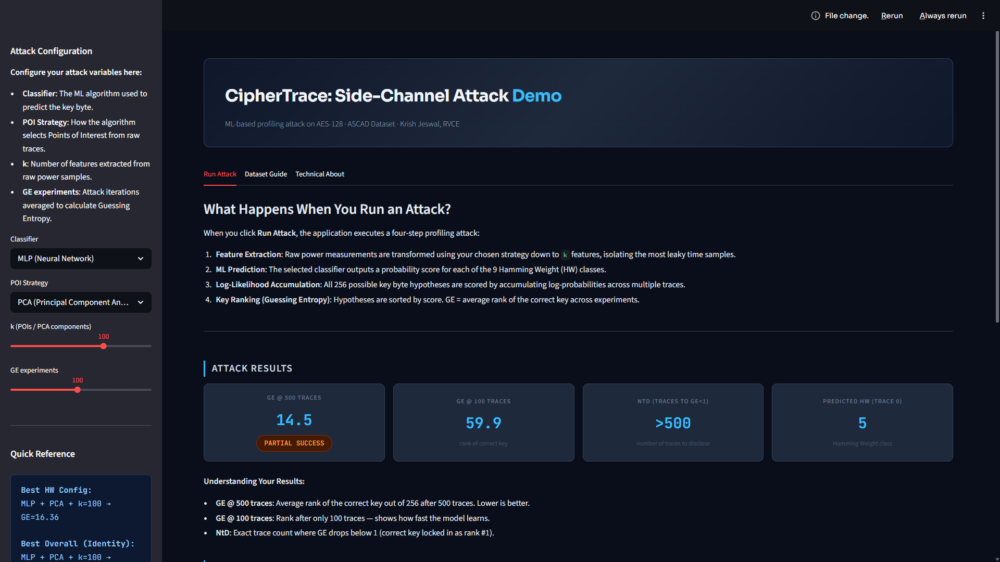

# CipherTrace


**ML-based side-channel attack on masked AES-128.**  
Systematic evaluation of feature engineering strategies for profiling attacks, with SHAP leakage localization and a leakage model comparison.

> Paper submitted to IEEE Access, May 2026.

---



---

## What this is

A complete profiling attack pipeline against a first-order Boolean masked AES-128 implementation. The target is the ASCAD fixed-key dataset — 50,000 power traces from an ATMega8515 microcontroller, captured by ANSSI (French National Cybersecurity Agency).

The core question: given a power trace recorded during AES encryption, can a classical ML model recover the secret key? And if so, which feature engineering strategy and classifier combination works best — measured not by accuracy, but by Guessing Entropy.

Three novel findings:

- **Macro F1 does not predict GE.** Decision Tree had the best F1 (0.1094) and one of the worst GE values (148.86). MLP had mid-range F1 and the best GE (16.36 at k=50 with PCA).
- **ANOVA is actively harmful on masked AES.** It selects mask-correlated samples instead of key-correlated ones, pushing GE above the random baseline of 127.
- **Identity labels break the key. HW labels do not.** Replacing 9-class Hamming Weight labels with 256-class Identity labels reduces GE from 12.03 to 0.46 at 500 traces — near-complete key recovery.

---

## Dataset

**ASCAD fixed-key** — published by ANSSI via [data.gouv.fr](https://www.data.gouv.fr/en/datasets/ascad-anssi-sca-database/)

The raw download from ANSSI is a large archive (~800 MB compressed). It does not ship as a ready-to-use `ASCAD.h5` — you need to extract the relevant HDF5 file from it. `generate_ascad.py` handles this: it locates the raw archive, extracts the fixed-key trace file, and writes `ASCAD.h5` to `data/` with the correct profiling/attack split.

| Property          | Value                                  |
| ----------------- | -------------------------------------- |
| Profiling traces  | 50,000                                 |
| Attack traces     | 10,000                                 |
| Samples per trace | 700                                    |
| Target byte index | 2                                      |
| Correct key byte  | 0xe0 (224)                             |
| Countermeasure    | First-order Boolean masking            |
| dtype             | int8 (cast to float32 before training) |
| Max SNR           | 0.0032                                 |

The low SNR (0.0032 at sample 567) is not a data quality issue — it confirms the masking countermeasure is working correctly. First-order Boolean masking splits every intermediate value into two random shares, making any single time sample uninformative in isolation.

---

## Results

### Classification Performance (SNR k=200)

| Classifier          | Accuracy   | Macro F1   |
| ------------------- | ---------- | ---------- |
| Random Forest       | **0.2713** | 0.0799     |
| XGBoost             | 0.2675     | 0.0871     |
| MLP                 | 0.2612     | 0.0867     |
| Logistic Regression | 0.2633     | 0.0748     |
| Decision Tree       | 0.2341     | **0.1094** |

Random baseline: accuracy = 0.111, Macro F1 ≈ 0.111. All models exceed it, confirming real leakage signal is present despite masking.

### Guessing Entropy at 500 Traces (k=50)

| Classifier          | SNR    | ANOVA  | PCA         |
| ------------------- | ------ | ------ | ----------- |
| MLP                 | 53.49  | 138.23 | **16.36 ★** |
| XGBoost             | 110.06 | 146.19 | 102.07      |
| Decision Tree       | 148.86 | 113.29 | 100.75      |
| Random Forest       | 121.86 | 146.66 | 134.45      |
| SVM                 | 126.63 | —      | —           |
| Logistic Regression | 151.76 | 149.91 | 153.82      |

Random baseline GE = 127. SVM ANOVA/PCA omitted — runtime exceeded at k=50.

### HW vs. Identity Labels (MLP + PCA k=100)

| Leakage Model  | Classes | GE@100 | GE@500   | NtD         |
| -------------- | ------- | ------ | -------- | ----------- |
| Hamming Weight | 9       | 51.34  | 12.03    | Not reached |
| Identity       | 256     | 9.81   | **0.46** | ~500 traces |

GE = 0.46 at 500 traces constitutes practical key recovery for the target byte.

---

## Project Structure

```
CipherTrace-side-channel-ml/
├── src/
│   ├── components/
│   │   ├── data_ingestion.py        # Load ASCAD.h5, return profiling/attack splits
│   │   ├── data_transformation.py   # POITransformer: SNR, ANOVA, PCA (sklearn API)
│   │   └── model_trainer.py         # Train 6 classifiers, 5-fold CV, joblib save
│   ├── pipeline/
│   │   ├── train_pipeline.py        # Orchestrates full training flow
│   │   └── predict_pipeline.py      # Load saved model, compute GE on attack traces
│   ├── utils.py                     # GE computation, SNR formula, SHAP helpers
│   ├── logger.py                    # Rotating file logger
│   └── exception.py                 # Custom exception with traceback detail
├── notebooks/
│   ├── 01_EDA.ipynb                 # Trace visualization, SNR spectrum, label dist
│   ├── 02_feature_engineering.ipynb # POI strategy comparison, PCA variance analysis
│   ├── 03_model_comparison.ipynb    # 72-run grid, GE heatmap, effect of k
│   └── 04_novel_contributions.ipynb # SHAP analysis, HW vs. Identity GE curves
├── artifacts/                       # Saved models (.joblib) and processed arrays
├── data/                            # ASCAD.h5 lives here (not committed — see setup)
├── app.py                           # Streamlit app: upload trace → predict key byte
├── generate_ascad.py                # Extracts ASCAD.h5 from the raw ANSSI archive
├── verify.py                        # Confirms dataset shapes before training
├── requirements.txt
├── setup.py
└── README.md
```

The pipeline architecture follows a modular end-to-end ML structure: each component is a standalone class with a single responsibility, configs are dataclasses, all trained models are serialized with joblib, and logging/exception handling run throughout.

---

## Setup

**1. Clone and create environment**

```bash
git clone https://github.com/KrishJeswal/CipherTrace-side-channel-ml
cd CipherTrace-side-channel-ml

python -m venv venv
source venv/bin/activate        # Windows: venv\Scripts\activate

pip install -r requirements.txt
```

**2. Download the raw ANSSI archive**

Go to [data.gouv.fr](https://www.data.gouv.fr/datasets/ascad) and download the ASCAD fixed-key archive. Place the downloaded file in the `data/` directory.

**3. Generate ASCAD.h5**

The archive does not ship as a ready-to-use HDF5 file. Run:

```bash
python generate_ascad.py
```

This extracts the fixed-key trace file from the archive and writes `data/ASCAD.h5` with the correct 50k/10k profiling/attack split.

**4. Verify the dataset**

```bash
python verify.py
# Expected output:
# profiling_traces: (50000, 700)
# attack_traces:    (10000, 700)
```

If shapes match, you're ready to train.

---

## Running the Pipeline

**Full training run (all 72 configurations):**

```bash
python src/pipeline/train_pipeline.py
```

Trains all 6 classifiers across 3 POI strategies and k ∈ {20, 50, 100, 200}. Saves models to `artifacts/`.

**GE evaluation on attack traces:**

```bash
python src/pipeline/predict_pipeline.py
```

**Explore results in notebooks:**

```bash
jupyter notebook notebooks/
```

Start with `01_EDA.ipynb` and work through in order.

**Streamlit app:**

```bash
streamlit run app.py
```

Upload a raw power trace and get a predicted Hamming Weight class and key byte probability distribution.

---

## Methodology

### Attack Target

The attack targets the AES-128 S-Box computation at Round 1:

```
v = S-Box[ plaintext_byte ⊕ key_byte ]
```

Under the Hamming Weight model, the device's power draw at that moment is proportional to `HW(v)` — the number of 1-bits in `v`. This gives 9 label classes (HW = 0 through 8). The attacker knows the plaintext (realistic in TLS, payment terminals, firmware boot sequences) and tests 256 key hypotheses, accumulating log-likelihood across traces to rank them. The correct key byte is 0xe0.

### POI Extraction Strategies

Three feature engineering strategies were evaluated, each reducing the 700-sample trace to k features:

**SNR** — domain-standard method. Computes `SNR[t] = Var(class means at t) / Mean(within-class variance at t)` at each time sample. Selects top-k by score. Explicitly models the HW leakage, so it finds key-correlated samples when leakage is first-order.

**ANOVA F-test** — generic ML feature selection via sklearn's `SelectKBest`. Makes no assumptions about leakage structure. On masked AES, this is effectively a negative control: it detects statistical differences that exist due to mask processing, not the secret key. SNR and ANOVA share only 13/50 selected samples at k=50.

**PCA** — dimensionality reduction across all 700 samples jointly. Unlike SNR and ANOVA, PCA combines correlated time samples rather than selecting a subset. The first 50 components capture 94.8% of trace variance. Because masking spreads leakage across two time windows (one for `v'`, one for the mask `m`), PCA can encode their joint statistics into a single component — which MLP then exploits non-linearly.

### Guessing Entropy

GE(N) is the mean rank of the correct key byte across 100 independent random experiments, each accumulating log-likelihood over N attack traces:

```
score(k) = Σᵢ log[ P(label(pᵢ, k)) + ε ]
```

GE = 0 means the correct key is always ranked first. GE = 127 is random guessing. GE < 5 is considered a practical attack in the literature.

---

## Key Findings

**Why Macro F1 doesn't predict GE:** GE depends on probability calibration, not argmax accuracy. Decision Trees produce overconfident leaf probabilities — log-likelihood accumulation amplifies this error exponentially. MLP's sigmoid outputs are inherently softer and better calibrated, making its probability outputs more useful for key ranking even when its F1 is lower.

**Why ANOVA fails on masked AES:** ANOVA selects samples where mask processing produces statistical differences across HW classes — not the secret key. ANOVA with MLP produces GE = 138.23, worse than random (127).

**Why PCA beats SNR:** SNR scores each of the 700 time samples independently and ignores correlations between them. Masking suppresses first-order leakage at every individual sample (peak SNR = 0.0032). PCA captures joint statistics across time windows, encoding the second-order masking signal that SNR cannot detect. SHAP analysis confirms MLP exploits components with only 2/10 overlap with SNR-selected regions.

**Why Identity labels outperform HW:** HW collapses all 256 S-Box outputs into 9 classes, discarding fine-grained discriminability. Identity preserves all 256 distinct byte values as separate classes. With 50,000 profiling traces, MLP has enough data to approximate the 256-class posterior — and the richer output space dramatically improves log-likelihood accumulation, accelerating convergence to GE ≈ 0.

---

## Tech Stack

- **Data** — h5py, numpy, pandas
- **ML** — scikit-learn, XGBoost
- **Explainability** — SHAP (KernelExplainer)
- **Visualization** — matplotlib, seaborn
- **App** — Streamlit
- **Serialization** — joblib

---

## Paper

**Systematic Evaluation of Machine Learning Classifiers and Feature Engineering Strategies for Side-Channel Attacks on Masked AES-128**  
Krish Jeswal — RV College of Engineering, Bangalore  
*Submitted to IEEE Access, May 2026*

---

## Author

**Krish Jeswal**  
Electronics and Telecommunication Engineering, RVCE (Batch 2024–2028)  
[GitHub](https://github.com/KrishJeswal) · [LinkedIn](https://linkedin.com/in/krishjeswal)